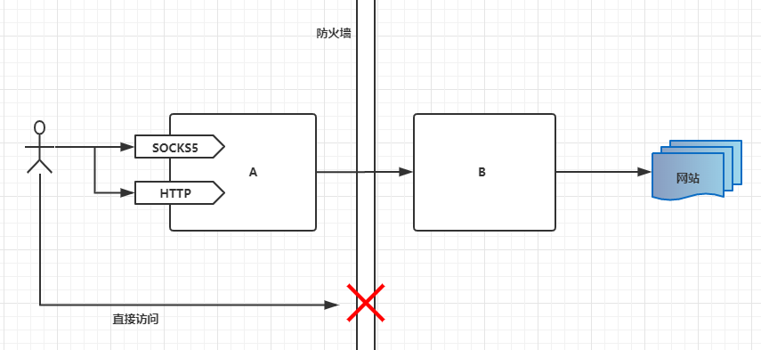

手把手教你用Rust写简易Proxy(一)

## 什么是代理?

客户端与服务器之前通讯时，需要经过中间的网络终端中转，这个中间的服务器就是代理服务器。

## 代理的功能?

> 以下内容摘自网络百科

提供代理服务的计算机系统或其它类型的网络终端称为代理服务器（英文：Proxy Server）。一个完整的代理请求过程为：客户端首先与代理服务器创建连接，接着根据代理服务器所使用的代理协议，请求对目标服务器创建连接、或者获得目标服务器的指定资源（如：文件）。在后一种情况中，代理服务器可能对目标服务器的资源下载至本地缓存，如果客户端所要获取的资源在代理服务器的缓存之中，则代理服务器并不会向目标服务器发送请求，而是直接传回已缓存的资源。一些代理协议允许代理服务器改变客户端的原始请求、目标服务器的原始响应，以满足代理协议的需要。代理服务器的选项和设置在计算机程序中，通常包括一个“防火墙”，允许用户输入代理地址，它会遮盖他们的网络活动，可以允许绕过互联网过滤实现网络访问。

代理服务器的基本行为就是接收客户端发送的请求后转发给其他服务器。代理不改变请求URI，会直接发送给前方持有资源的目标服务器。

## 代理协议有哪些？

本系列中只涉及几种常用的协议

* SOCKS5
* HTTP代理
* HTTPS代理

## 这些代理协议存在什么问题？

这些代理协议在通讯或者建立通讯的时候存在明文传输的情况，所以使用时可能会被网络提供者监测。这样的话就存在一定的隐私泄露问题。比如你通过HTTPS代理服务器访问pornhub时，由于浏览器会先发出一个CONNECT请求，报文内容中会包含pornhub服务器的地址。网管就会知道你在逛什么网站了。

那么该如何解决这一问题呢？有人就提出将代理服务器分成两部分，程序A运行在用户本地，它支持常规的代理协议，另一部分程序B运行在我们的服务器上。A和B之间的通讯采用我们自己定义的协议及加密方式。这样一来我们的网络访问请求将变得非常隐秘，不容易被识别。

综上所述，整个代理结构如下:

