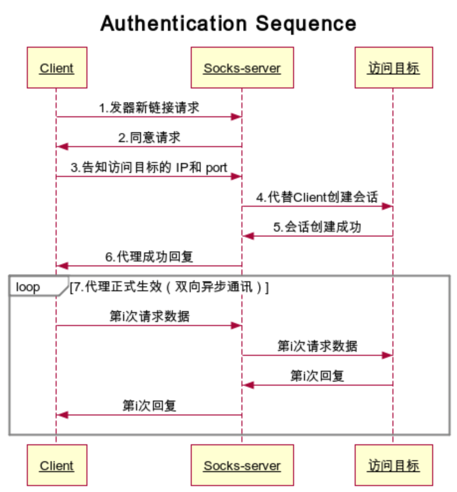

# SOCKS5协议

> SOCKS是一种网络传输协议，主要用于客户端与外网服务器之间通讯的中间传递。SOCKS是"SOCKetS"的缩写

SOCKS的最小协议是版本5，与4相比，增加支持UDP，验证，以及IPv6。

## 基本原理

当防火墙后的客户端要访问外部的服务器时，要先和SOCKS代理服务器连接。通过鉴权之后，将外部服务器的地址告知代理服务器，代理服务器在建立与外部服务器的连接后，会将客户端的请求发往该外部服务器，并将外部服务器的响应结果返回给客户端。

本次教程将使用[async-std](https://docs.rs/async-std/1.4.0/async_std/)来完成网络部分的功能，所以文字中可能涉及相关代码。

## 过程图解

## 协议详解

1. 客户端在创建与SOCKS5服务器的TCP连接后，需要先发送请求的协议版本及认证方式，格式为(单位：字节):

| VER  | NMETHODS | METHODS |
| ---- | -------- | ------- |
| 1    | 1        | 1       |

* VER是SOCKS版本，SOCKS5就是0x05
* NMETHOS是METHODS部分的长度
* METHODS是客户端支持的认证方式列表，每个方法占一字节。目前有L
  * 0x00 不需要认证
  * 0x01 GSSAPI
  * 0x02 用户名，密码认证
  * 0x03 - 0x7F 由IANA分配
  * 0x80 - 0xFE 为个人保留方法
  * 0xFF 无可接受的方法

2. 服务器从客户端提供的方法中选择一个并通过以下格式告知客户端：

| VER  | METHOD |
| ---- | ------ |
| 1    | 1      |

* VER是SOCKS版本，SOCKS5就是0x05
* METHOD是服务端选中的方法。如果返回0xFF表示没有一个认证方法被选中，客户端需要关闭连接。

3. 进行用户名，密码的认证时，客户端需要通过以下格式将用户名和密码发送给服务器：

| VER  | ULEN | UNAME | PLEN | PASSWD |
| ---- | ---- | ----- | ---- | ------ |
| 1    | 1    | 1-255 | 1    | 1-255  |

* VER为认证的版本，SOCKS5请使用0x01
* ULEN是用户名的长度
* UNAME是用户名
* PLEN是密码的长度
* PASSWD是密码

4. 服务端完成用户名，密码的认证后，需要将认证结果通过以下格式发送给客户端：

| VER  | STATUS |      |
| ---- | ------ | ---- |
| 1    | 1      |      |

* VER为认证的版本，SOCKS5请使用0x01
* STATUS为认证结果，0x00表示认证成功，其他任意值视为认证失败，客户端需要关闭连接。

5. 客户端在完成认证后要发送请求，请求的格式如下：

| VER  | CMD  | RSV  | ATYP | DST.ADDR | DST.PORT |
| ---- | ---- | ---- | ---- | -------- | -------- |
| 1    | 1    | 0x00 | 1    | Variable | 2        |

* VER是SOCKS版本，SOCKS5就是0x05
* CMD为具体命令：
  * 0x01：CONNECT
  * 0x02：BIND
  * 0x03：UDP转发

* RSV：保留字段
* ATYP：地址的类型
  * 0x01：IPv4地址
  * 0x03：域名
  * 0x04：IPv6地址
* DST.ADDR：目标地址
  * IPv4地址为4字节
  * 域名格式为1字节长度后跟1-255字节的域名
  * IPv6地址为16字节
* DST.PORT：目标端口，为网络字节序

6. 服务器响应客户端请求，响应格式如下：

| VER  | REP  | RSV  | ATYP | BND.ADDR | BND.PORT |
| ---- | ---- | ---- | ---- | -------- | -------- |
| 1    | 1    | 0x00 | 1    | Variable | 2        |

* VER是SOCKS版本，SOCKS5就是0x05
* REP是响应字段：
  * 0x00：成功
  * 0x01：服务器错误
  * 0x02：规则禁止
  * 0x03：网络不可达
  * 0x04：主机不可达
  * 0x05：连接被拒
  * 0x06： TTL超时
  * 0x07：不支持的命令
  * 0x08：不支持的地址类型
  * 0x09 - 0xFF：尚未定义

* RSV：保留字段
* ATYP：地址的类型
  * 0x01：IPv4地址
  * 0x03：域名
  * 0x04：IPv6地址
* DST.ADDR：服务器绑定地址
* DST.PORT：服务器绑定端口，为网络字节序

在完成了这些操作之后，就可以开始传输数据了。在下一篇文章中，我们一起使用async-std完成一个简单的无认证的SOCKS5客户端和服务器。
